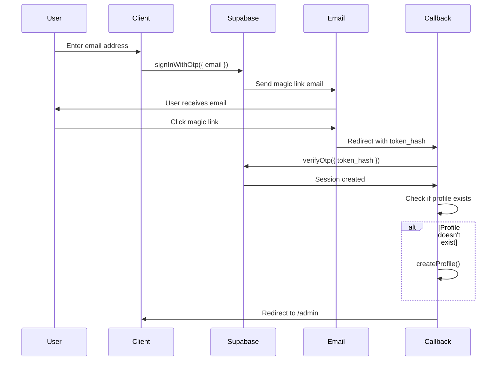
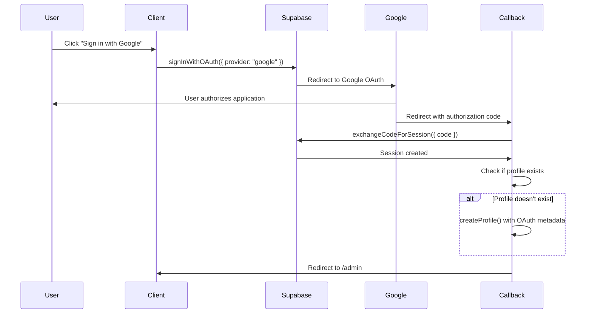
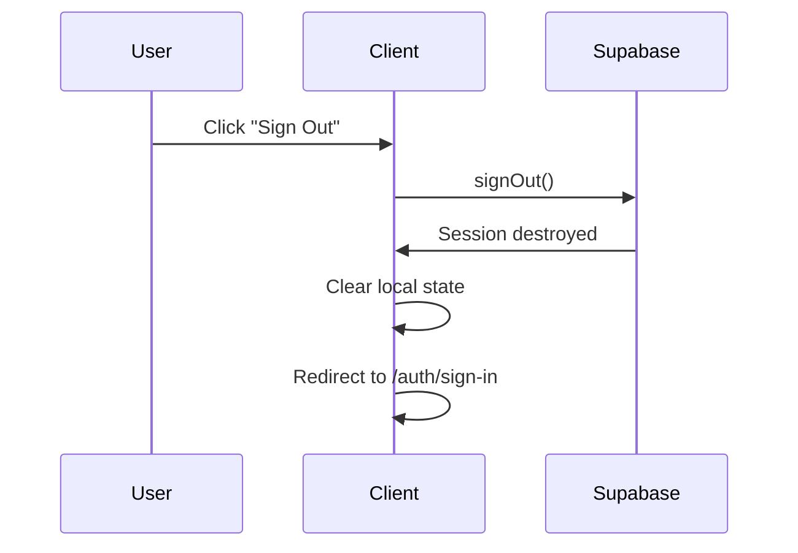
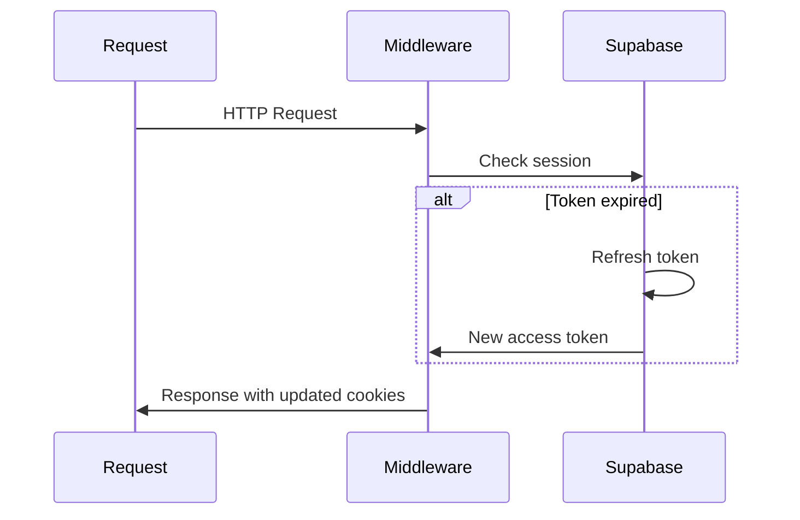

# Authentication Flows

## Overview

This document describes the authentication flows implemented in the SDG Application. The system supports Magic Link (passwordless) and OAuth authentication methods.

## Magic Link Authentication Flow

Magic Link authentication allows users to sign in without a password by clicking a link sent to their email address.

### Flow Diagram



### Step-by-Step Flow

1. **User Initiates Sign In**
   - User navigates to `/auth/sign-in`
   - User enters email address in passwordless form
   - Form component: `src/features/auth/components/passwordless-auth-form.tsx`

2. **Magic Link Request**
   - Client calls `supabase.auth.signInWithOtp({ email })`
   - Supabase sends magic link email to user
   - Email contains token hash and callback URL

3. **User Clicks Magic Link**
   - User receives email and clicks magic link
   - Browser redirects to `/auth/callback` with `token_hash` and `type` query parameters

4. **Token Verification**
   - Callback route (`src/app/auth/callback/route.ts`) receives request
   - Route verifies token using `supabase.auth.verifyOtp()`
   - Supabase creates session if token is valid

5. **Profile Creation**
   - Callback route checks if user profile exists
   - If profile doesn't exist, creates profile automatically
   - Extracts user metadata (name, avatar) if available

6. **Redirect to Dashboard**
   - User redirected to `/admin` dashboard
   - Session cookies set automatically

### Implementation Details

**Component**: `src/features/auth/components/passwordless-auth-form.tsx`

```typescript
const { error: otpError } = await supabase.auth.signInWithOtp({
  email: result.data.email,
  options: {
    shouldCreateUser: true, // Auto-create user if doesn't exist
    emailRedirectTo: getAuthCallbackUrl(),
  },
});
```

**Callback Handler**: `src/app/auth/callback/route.ts`

```typescript
if (token_hash && type) {
  // Magic Link callback
  const { error } = await supabase.auth.verifyOtp({
    token_hash,
    type: type as "email",
  });
}
```

### Error Handling

- **Invalid Token**: Redirects to `/auth/sign-in?error=invalid_link`
- **Network Errors**: User-friendly error messages displayed
- **Rate Limiting**: Handles rate limit errors gracefully

## OAuth Authentication Flow (Google)

OAuth authentication allows users to sign in using their Google account.

### Flow Diagram



### Step-by-Step Flow

1. **User Initiates OAuth Sign In**
   - User clicks "Continue with Google" button
   - Component: `src/features/auth/components/google-oauth-button.tsx`

2. **OAuth Request**
   - Client calls `supabase.auth.signInWithOAuth({ provider: "google" })`
   - Supabase redirects user to Google OAuth consent screen
   - OAuth parameters include:
     - `redirectTo`: Callback URL
     - `access_type`: "offline" (for refresh tokens)
     - `prompt`: "consent" (to ensure refresh token)

3. **User Authorization**
   - User sees Google OAuth consent screen
   - User authorizes application
   - Google redirects back to callback URL with authorization code

4. **Code Exchange**
   - Callback route receives authorization code
   - Route exchanges code for session using `supabase.auth.exchangeCodeForSession()`
   - Supabase creates session with user information

5. **Profile Creation**
   - Callback route checks if user profile exists
   - If profile doesn't exist, creates profile with OAuth metadata:
     - `full_name`: From `user.user_metadata.full_name` or `user.user_metadata.name`
     - `avatar_url`: From `user.user_metadata.avatar_url`

6. **Redirect to Dashboard**
   - User redirected to `/admin` dashboard
   - Session cookies set automatically

### Implementation Details

**Component**: `src/features/auth/components/google-oauth-button.tsx`

```typescript
const { error: oauthError } = await supabase.auth.signInWithOAuth({
  provider: "google",
  options: {
    redirectTo: getAuthCallbackUrl(),
    queryParams: {
      access_type: "offline",
      prompt: "consent",
    },
  },
});
```

**Callback Handler**: `src/app/auth/callback/route.ts`

```typescript
if (code) {
  // OAuth callback (Google)
  const { error } = await supabase.auth.exchangeCodeForSession(code);
  
  if (user) {
    // Extract OAuth metadata
    const fullName =
      user.user_metadata?.full_name || user.user_metadata?.name || null;
    const avatarUrl = user.user_metadata?.avatar_url || null;
    
    // Create profile if doesn't exist
    await createProfile({
      full_name: fullName,
      avatar_url: avatarUrl,
    });
  }
}
```

### Error Handling

- **OAuth Errors**: Redirects to `/auth/sign-in?error=oauth_error`
- **Network Errors**: User-friendly error messages displayed
- **Profile Creation Errors**: Logged but don't block authentication

## Sign Out Flow

### Flow Diagram



### Step-by-Step Flow

1. **User Initiates Sign Out**
   - User clicks sign out button
   - Component: `src/features/auth/components/sign-out-button.tsx`

2. **Session Destruction**
   - Client calls `supabase.auth.signOut()`
   - Supabase destroys session
   - Cookies cleared automatically

3. **State Cleanup**
   - Client clears local authentication state
   - User redirected to `/auth/sign-in`

### Implementation

```typescript
const handleSignOut = async () => {
  await supabase.auth.signOut();
  router.push("/auth/sign-in");
};
```

## Session Refresh Flow

Sessions are automatically refreshed by the Next.js middleware.

### Flow Diagram



### Step-by-Step Flow

1. **Request Received**
   - User makes HTTP request
   - Request includes session cookies

2. **Middleware Intercepts**
   - Next.js middleware (`src/middleware.ts`) intercepts request
   - Calls `updateSession()` helper

3. **Session Check**
   - Middleware creates Supabase client with cookies
   - Calls `supabase.auth.getUser()` to check session

4. **Token Refresh (if needed)**
   - If access token expired, Supabase automatically refreshes
   - New access token stored in cookies
   - Refresh token used to obtain new access token

5. **Response with Updated Cookies**
   - Middleware returns response with updated session cookies
   - User continues with refreshed session

### Implementation

**Middleware**: `src/middleware.ts`

```typescript
export async function middleware(request: NextRequest) {
  return await updateSession(request);
}
```

**Session Update**: `src/utils/supabase/middleware.ts`

```typescript
export async function updateSession(request: NextRequest) {
  const supabase = createServerClient(
    env.NEXT_PUBLIC_SUPABASE_URL,
    env.NEXT_PUBLIC_SUPABASE_ANON_KEY,
    {
      cookies: {
        getAll() {
          return request.cookies.getAll();
        },
        setAll(cookiesToSet) {
          // Update cookies in response
        },
      },
    },
  );

  // This automatically refreshes expired tokens
  const { data: { user } } = await supabase.auth.getUser();
  
  // Route protection logic...
  
  return supabaseResponse;
}
```

## Error Handling

### Magic Link Errors

- **Invalid Link**: Token expired or invalid
  - Redirect: `/auth/sign-in?error=invalid_link`
  - User must request new magic link

- **Rate Limiting**: Too many requests
  - Error message: "Too many requests. Please wait a moment and try again."
  - User must wait before requesting new link

### OAuth Errors

- **OAuth Error**: Provider authentication failed
  - Redirect: `/auth/sign-in?error=oauth_error`
  - User can try again

- **Network Errors**: Connection issues
  - Error message: "Network error. Please check your connection and try again."

### Profile Creation Errors

- **Profile Creation Failure**: Database error
  - Error logged but doesn't block authentication
  - Profile can be created later when user accesses profile page

## Security Considerations

### Token Security

- **Magic Link Tokens**: Single-use, time-limited tokens
- **OAuth Tokens**: Secure token exchange via authorization code flow
- **Session Tokens**: Stored in HTTP-only cookies

### Redirect Security

- **Callback URLs**: Validated to prevent open redirects
- **Token Validation**: Tokens verified server-side
- **CSRF Protection**: SameSite cookie attribute prevents CSRF attacks

## Configuration

### Magic Link Configuration

No additional configuration required. Supabase handles email sending automatically.

### OAuth Configuration

OAuth providers must be configured in Supabase Dashboard:

1. Navigate to **Authentication > Providers**
2. Enable **Google** provider
3. Configure OAuth credentials:
   - Client ID
   - Client Secret
4. Set redirect URLs:
   - `https://your-domain.com/auth/callback`

## Related Documentation

- [Authentication Overview](./overview.md) - System overview
- [Auth Providers](./providers.md) - Provider configuration
- [Authorization Patterns](./authorization.md) - Authorization after authentication
